

# Проект "TODO-list REST API"

* [Описание](#описание)
* [Функционал](#функционал)
* [Технологии](#технологии)
* [Архитектура](#архитектура)
* [Интерфейс](#интерфейс)
* [Документация JavaDoc](#javadoc)
* [Тесты](#тесты)
* [Автор](#автор)
* [Критика и предложения](#критика_и_предложения)

## Описание
MVC REST API - приложение, todo-список действий, которые нужно выполнить.
Для хранения данных применяется Hibernate.
Данные на главную страницу(где располагается сам список действий и интерфейс работы с ним)
подгружаются через AJAX-запросы, которые возвращают данные в формате JSON.
При изменении списка он так же изменяется динамически без перезагрузки страницы.

## Функционал
* Регистрация пользователя
* Аутентификация на сервлет-фильтрах
* Авторизация через БД PostgreSQL
* Добавление задачи в TODO-list
* Пометить задачу как выполненную
* Вывод всех задач
* Вывод только незавершённых задач
* Для каждого зарегистрированного пользователя хранится свой собственный список 
  задач.

## Технологии
* Hibernate
* Java14
* JDBC
* PostgreSQL
* AJAX jquery
* Servlet&JSP
* HTML, CSS, BOOTSTRAP
* Apache Tomcat Server
* Junit, Hamcrest, Mockito, Powermock
* Travis CI
* Checkstyle

## Архитектура

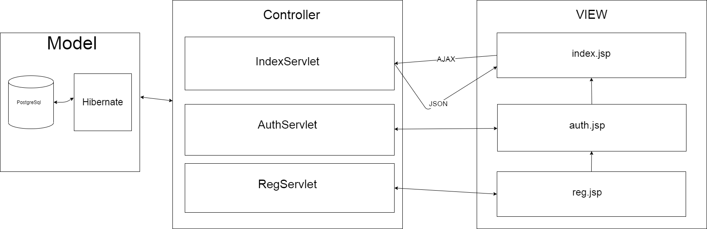

Проект реализован по шаблону MVC и разделён на слои:

1. Хранилища(Model)

    1.1 [HibernateUserStore](src/main/java/ru/job4j/todo/store/HibernateUserStore.java) - 
    Hibernate-хранилище для авторизационных данных пользователей.
    
    1.2 [HibernateTaskStore](src/main/java/ru/job4j/todo/store/HibernateTaskStore.java) - 
    Hibernate-хранилище для задач из TODO-списка.
    
2. JSP - View
    
    2.1 [index.jsp](src/main/webapp/index.jsp) - главная страница приложения.
    На ней отображаются все задачи и интерфейс взаимодействия с ними, форма для
    добавления новых задач.
    2.2 [auth.jsp](src/main/webapp/auth.jsp) - страница авторизации. Поддерживает валидацию данных.
    Если пользователя с данным логином не существует, или пароль неверен, 
    будет выведено всплывающее окно с ошибкой.
    2.3 [reg.jsp](src/main/webapp/reg.jsp) - страница регистрации. Поддерживает валидацию даннных.
    Если пользователь с введённым логином уже существует, будет выведено всплывающее окно
    с ошибкой.
    
3. Сервлеты - Controller
    
    3.1 [AuthServlet](src/main/java/ru/job4j/todo/servlet/AuthServlet.java) - 
    Сервлет авторизации. Принимает запрос с JSP, производит валидацию введённых
    пользователем данных, существует ли в PostgreSQL хранилище такой пользователь. В случае успешной авторизации, добавляет
    пользователя в Http-сессию.   
    
    3.2 [RegServlet](src/main/java/ru/job4j/todo/servlet/RegServlet.java) - 
    Сервлет регистрации. Принимает запрос с JSP, производит валидацию. В случае успешной
    регистрации добавляет нового пользователя в PostgreSQL- хранилище и в Http-сессию, производит
    авторизацию.   
    
    3.3 [IndexServlet](src/main/java/ru/job4j/dream/servlet/IndexServlet.java) - 
    Функции сервлета:
        * doGet метод - отправка актуальных данных о списке задач в формате JSON
          в ответ на AJAX-запрос на главную страницу приложения.
        * doPost метод:
            1. Добавление новой задачи в хранилище
            2. "Закрытие" старой задачи.  
    
4. Фильтры
    4.1 [AuthFilter](src/main/java/ru/job4j/todo/filter/AuthFilter.java) - 
    Блокирует доступ неавторизованному пользователю ко всем страницами приложения,
    кроме страниц авторизации и регистрации.
    4.2 [CorsFilter](src/main/java/ru/job4j/todo/filter/CorsFilter.java) - 
    Cross-Origin-Resource-Sharing фильтр. Допускает междоменные запросы, когда
    клиент и сервер находятся на разных машинах.
     
## Интерфейс
1. Регистрация.

    1.1 Зарегистрируемся.
    
    
    
    1.2 Попробуем ещё раз зарегистрироваться с этими же данными.
    
    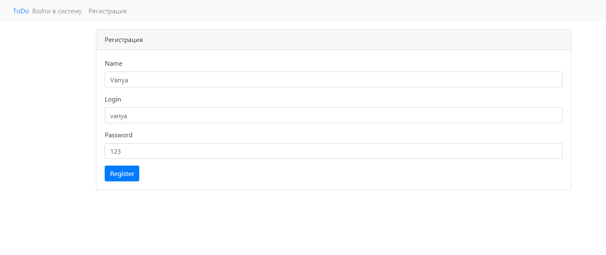 
    
    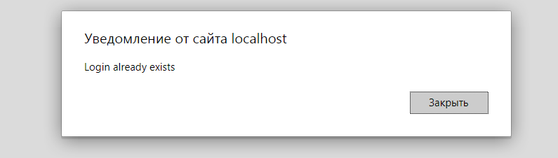

2. Авторизация.

    2.1 Попробуем авторизоваться с несуществующим e-mail
    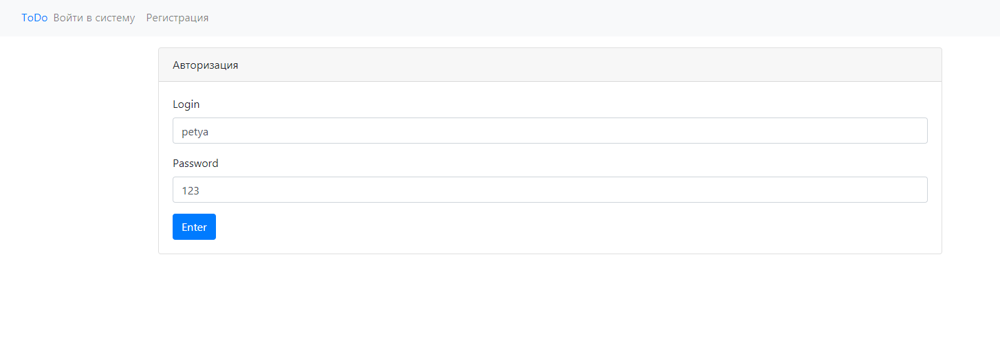
    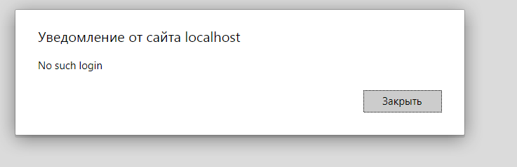
    2.2 Попробуем авторизоваться с неверным паролем
    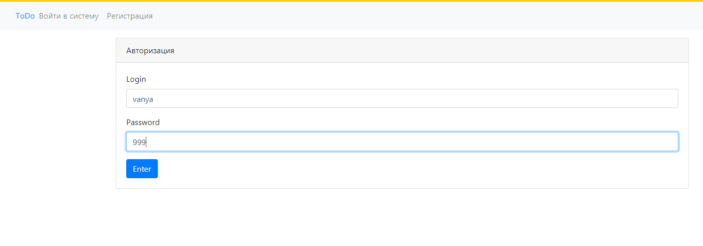
    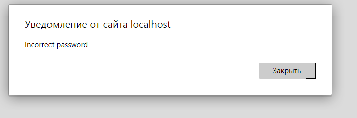
    2.3 Авторизуемся с верными данными
    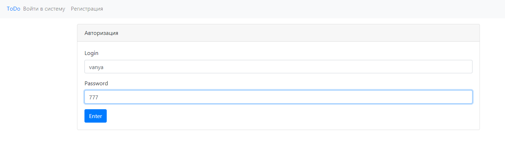
    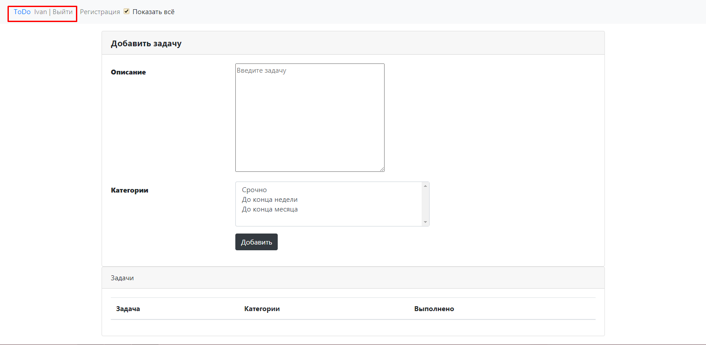

3. Работа со списком задач
    
   3.1 Добавим первую задачу.
   
   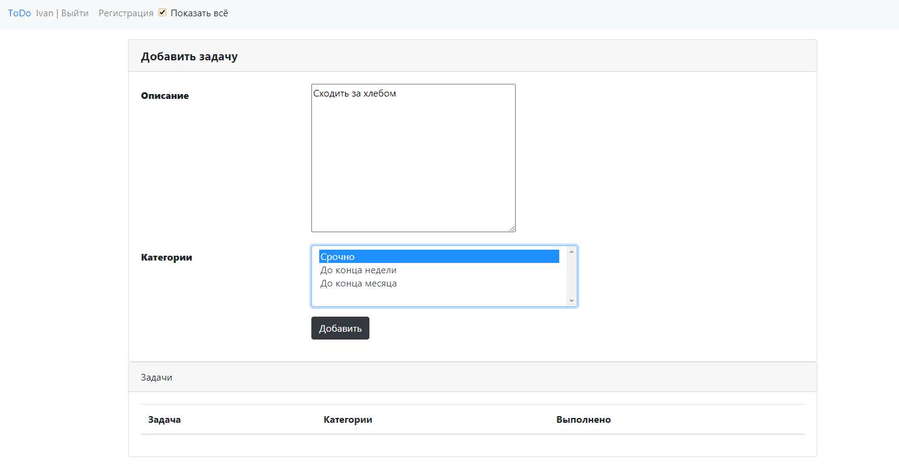
   
   Видим, что задача добавилась:
   
   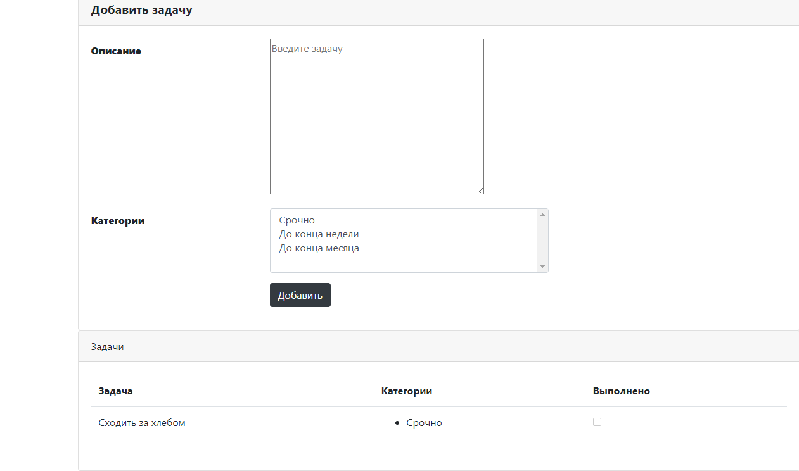
   
   3.2 Добавим ещё несколько задач:
   
   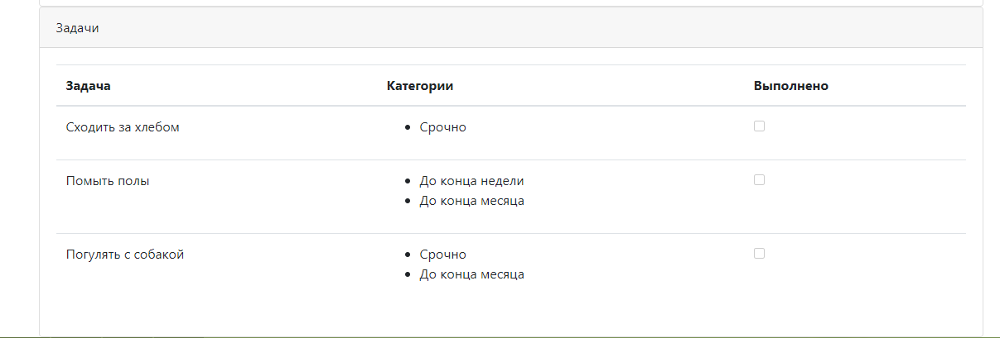
   
   3.3 Отметим одну задачу как выполненную(нажмём галочку в checkbox)
   
   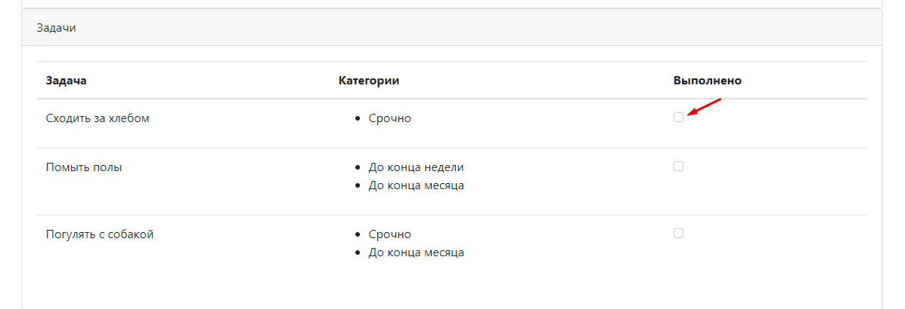
   
   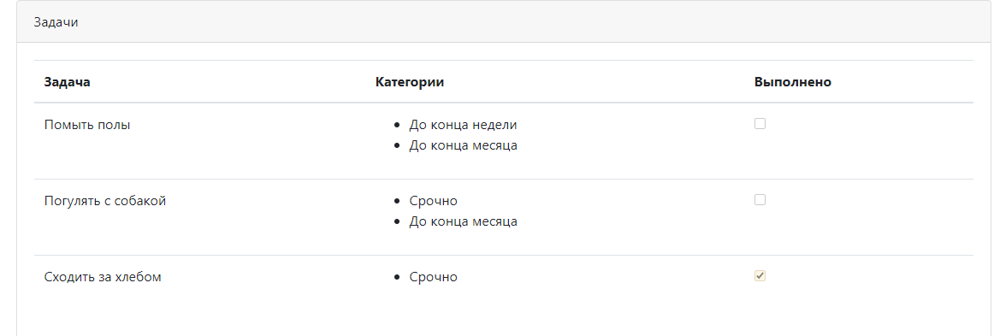
   
   Как видим, задача помечена как выполненная. Теперь уберём галочку "Показать все", и будут выводиться только
   невыполненные задачи.
   
   
   
   
   
   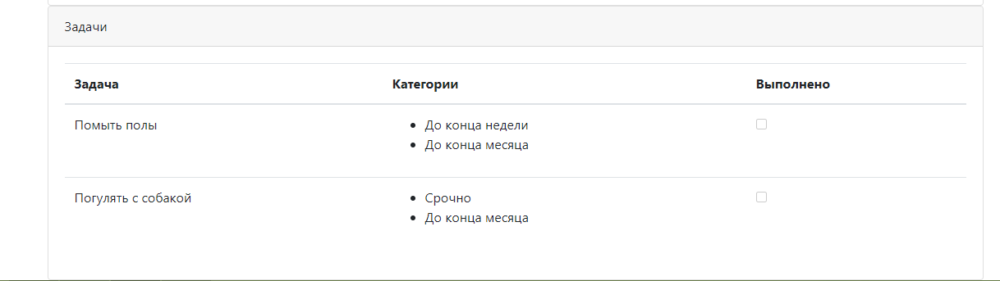
   
   
    
## JavaDoc
TODO

## Тесты
На сервлеты написаны тесты с 
применением технологий Mockito и Powermock:
* [AuthServletTest](src/test/java/ru/job4j/todo/servlet/AuthServletTest.java) - 
тесты на AuthServlet
* [RegServletTest](src/test/java/ru/job4j/todo/servlet/RegServletTest.java) - 
тесты на RegServlet

На Hibernate-хранилища написаны интеграционные тесты с применением технологии HsqlDB:
* [HibernateTaskStoreTest](src/test/java/ru/job4j/todo/store/HibernateTaskStoreTest.java) - 
тесты на HibernateTaskStore
* [HibernateUserStoreTest](src/test/java/ru/job4j/todo/store/HibernateUserStoreTest.java) - 
тесты на HibernateUserStore

## Автор

Гераськин Егор Владимирович

Java-разработчик

yegeraskin13@gmail.com

+79271506651

## Критика_и_предложения
Все замечания и пожелания по этому проекту просьба направлять мне 
на электронный адрес: yegeraskin13@gmail.com